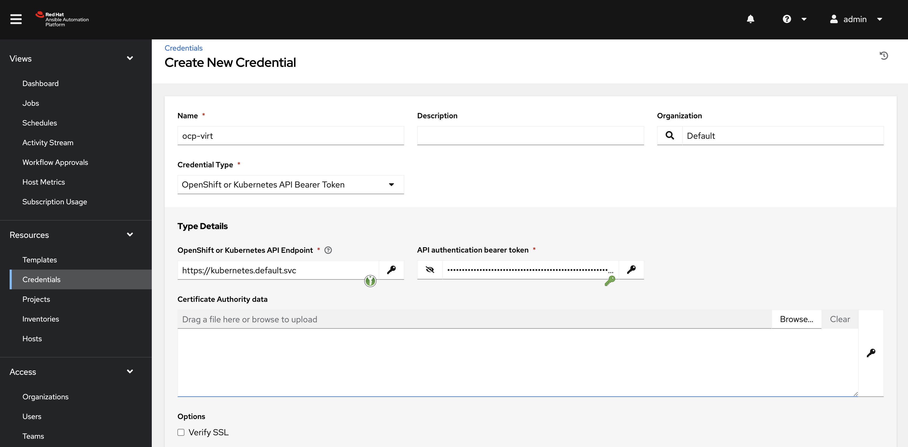
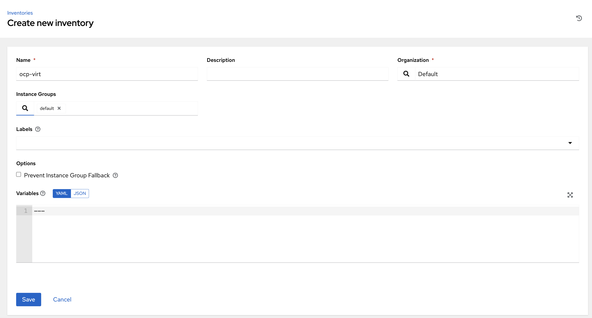
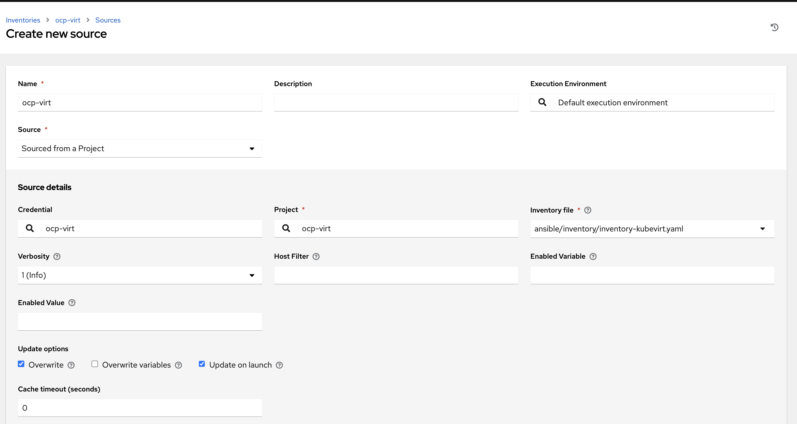

# Welcome to the OpenShift Virtualization Roadshow extra exercises


## AAP on OpenShift

Fork this repo first!

SSH to your `hypervisor.XXX.dynamic.redhatworkshops.io` as 
`lab-user`.

Then:

```bash
$ sudo -i
$ ssh root@192.168.123.100
```

Clone your forked repo!

### Installing

1. Install the AAP operator and add a controller: `oc apply -f manifests/aap-operator-install.yaml`
2. Get the route for the controller: `oc get routes -n ansible-automation-platform controller`
3. Get the login for the controller: `oc extract -n ansible-automation-platform secret/controller-admin-password --to -`
4. Login to the controller, request a trial subscription.

### Setting up a project and a dynamic Kubevirt Inventory in the AAP Controller

First we need a credential. This token *should be scoped* but for now let's just add a cluster-admin scoped token.

1. Add a ServiceAccount: `oc create sa controller-credential`
2. Add cluster-admin rights to the service account: `oc adm policy add-cluster-role-to-user cluster-admin -z controller-credential` 
3. Create a token for the SA: `oc create token controller-credential --duration=4294967296s` (hmm 136 years, 29 weeks, 3 days, 6 hours, 28 minutes, 16 seconds. :-0). Copy it and add it as a Credential in the controller:
 It's also possible to add the Credential using the a declarative approach. Apply a `kind: AnsibleCredential` to your cluster. See the example [here.](https://github.com/ansible/awx-resource-operator/blob/devel/config/samples/credentials/tower_v1alpha1_ansiblecredential-bearer.yaml).

4. Connect the Resource operator to the automation controller:

    a. In the navigation panel, select Access Users.

    b. Select the username you want to create a token for.

    c. Click on Tokens, then click Add. Copy the token.

    d. You can leave Applications empty. Add a description and select Read or Write for the Scope.

    Add a secret with the token:

    ```bash
    oc apply -f - <<EOF
    apiVersion: v1
    kind: Secret
    metadata:
      name: controller-access
    type: Opaque
    stringData:
      token: <generated-token>
      host: https://<my-controller-host.example.com>
    EOF
    ```

5. Create a new project:

    ```bash
    oc apply -f - <<EOF
    apiVersion: tower.ansible.com/v1alpha1
    kind: AnsibleProject
    metadata:
      name: ocp-virt
    spec:
      repo: https://github.com/cldmnky/ocp-virt-roadshow
      branch: main
      name: ocp-virt
      scm_type: git
      organization: Default
      description: 'OCP Virt Lab' 
      connection_secret: controller-access
      runner_pull_policy: IfNotPresent
    EOF
    ```
6. Add an inventory:

    

    And add a new source from your project and set credentials and inventory file:

    

    The sync should be successful.

### Connecting to vm's in the cluster

* Create a new project; `vms`.
* Add a default public SSH key for that project in Virtualization/Settings/User
* Add the private key to your credentials, the username should (most probably be `cloud-user`)
* Add a Template and select the `ping`playbook from your project.
* Run it!

### Observability

Now that we can run ansible on the VM, lets start monitoring them!

We will install the excellent `node-exporter` on the VM, and add a service so we can deploy a service monitor and scrape the VM.

* Create a `Job Template` for the `ansible/playbooks/node-exporter.yaml` playbook in the forked repo.
  * Using the Controller UI or declarative by applying a `JobTemplate`:

    ```yaml
    apiVersion: tower.ansible.com/v1alpha1
    kind: JobTemplate
    metadata:
      name: install-node-exporter
    spec:
      connection_secret: controller-access
      name: InstallNodeExporter
      project: ocp-virt
      playbook: ansible/playbooks/node-exporter.yaml
      inventory: ocp-virt
    ```
  
  *note:* You need to add the correct credentials to the Job Template if you created it using the declarative approach.

* Setup and install `virtctl` so you can ssh to a machine.
  * Verify that the `node_exporter` is installed on the VM.

* Let's expose the `node_exporter` as a service:

  ```bash
    $ oc project <project/namespace of the vm>
    $ oc get vmi
    NAME                      AGE   PHASE     IP             NODENAME           READY
    rhel9-teal-crocodile-53   84m   Running   10.128.0.106   borg.blahonga.me   True
    $ virtctl expose vmi rhel9-teal-crocodile-53 --port 9100 --target-port 9100 --name teal-crocodile-node-exporter --port-name=metrics
    $ oc get svc
    NAME                           TYPE        CLUSTER-IP       EXTERNAL-IP   PORT(S)    AGE
    teal-crocodile-node-exporter   ClusterIP   172.30.101.177   <none>        9100/TCP   5m9s
    $ oc port-forward pods/virt-launcher-rhel9-teal-crocodile-53-gfwqm 9100:9100
    $ curl localhost:9100/metrics
  ```

  * We have now exposed the the `node_exporter` as a service on the VM.
    * Label the service so we can create a generic `ServiceMonitor`:
      `oc label svc teal-crocodile-node-exporter app=node-exporter`

  * Enable user monitoring in the cluster:
    * Edit the cluster-monitoring-config ConfigMap object (or create it if it's not there):

    ```bash
    oc -n openshift-monitoring edit configmap cluster-monitoring-config
    ```

    Enable user-monitoring by adding enableUserWorkload: true under data/config.yaml:

    ```yaml
    apiVersion: v1
    kind: ConfigMap
    metadata:
      name: cluster-monitoring-config
      namespace: openshift-monitoring
    data:
      config.yaml: |
        enableUserWorkload: true
    ```

    If it does not exist create it: `oc apply -f manifests/cluster-monitoring-config.yaml`.

* Create a `ServiceMonitor` to scrape the VM's metrics:

    ```bash
    oc apply -f - <<EOF
    apiVersion: monitoring.coreos.com/v1
    kind: ServiceMonitor
    metadata:
      name: vms-node-exporter
      namespace: vms 
    spec:
      endpoints:
      - interval: 30s
        port: metrics
        path: /metrics
        scheme: http
      selector: 
        matchLabels:
          app: node-exporter
    EOF
    ```

* Verify that you can see metrics from the VM by querying the metrics in the Console: `rate(node_disk_io_time_weighted_seconds_total{job="vms-node-exporter"}[5m])`

## Hosted Control Planes

Hosted Control Planes allows us to run virtualized OpensHift Clusters on OpenShift with containerized control planes.

> [!TIP]
> With hosted control planes for OpenShift Container Platform, you create control planes as pods on a hosting cluster without the need for dedicated virtual or physical machines for each control plane.
> 

Hosted control planes are available in the multicluster engine operator. THe easiest way to get started is to install Advanced Cluster Management in the Operator Hub.

* Install *Advanced Cluster Management* and create a `multiclusterhub`custom resource.

* You will need a pull secret, so go to https://console.redhat.com and get a pull secret.

* Add the pullsecret to a file on the bastion host.
     `mkdir hcp && cd hcp && vi pull-secret.json`

* Download the HCP binary from your cluster:
  ```bash
  curl -O https://hcp-cli-download-multicluster-engine.apps.p79w8.dynamic.redhatworkshops.io/linux/amd64/hcp.tar.gz && tar zxf hcp.tar.gz
  ```

* Patch the ingress contorller to allow wildcards: `oc patch ingresscontroller -n openshift-ingress-operator default --type=json -p '[{ "op": "add", "path": "/spec/routeAdmission", "value": {wildcardPolicy: "WildcardsAllowed"}}]'`

* Install a cluster:
  ```bash
  export CLUSTER_NAME=hosted01
  export PULL_SECRET_PATH=./pull-secret.json
  export OCP_VERSION=quay.io/openshift-release-dev/ocp-release:4.16.10-multi
  hcp create cluster kubevirt \
    --name ${CLUSTER_NAME} \
    --pull-secret ${PULL_SECRET_PATH}  \
    --node-pool-replicas 3 \
    --cores 4 \
    --memory 16Gi \
    --auto-repair \
    --root-volume-size 50 \
    --release-image ${OCP_VERSION}

